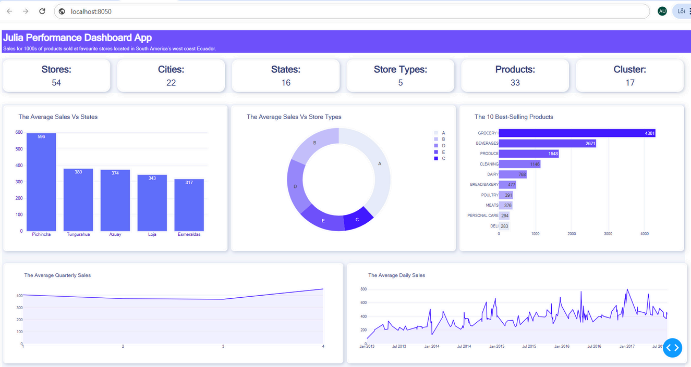
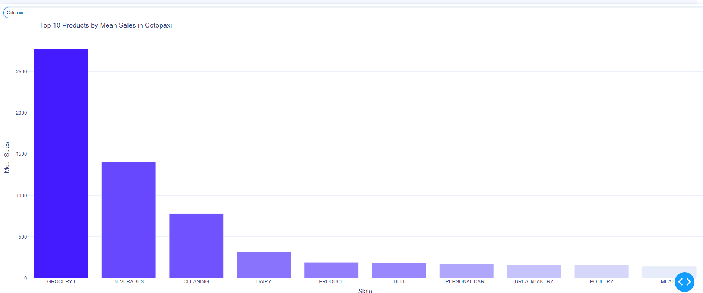

# Sales Data Visualization in Julia


## Project Overview
This project demonstrates how to efficiently perform data cleaning, feature engineering, and interactive visualizations using Julia for a real-world sales dataset. The dataset used comprises sales data from various stores across Ecuador. The project showcases data processing, visualization, and exploration techniques, and it is built with `CSV.jl`, `DataFrames.jl`, `PlotlyJS.jl`, and `Dash.jl` for the frontend interactive dashboard.

The visualizations include trend analysis, sales comparisons by store and product, seasonal decomposition, and geographical insights. This project is part of a data analysis portfolio, demonstrating advanced data manipulation and visualization using Julia for business intelligence (BI) applications.

## Features
- **Data Preprocessing**: Merging multiple datasets (e.g., sales data, holidays), handling missing data, and feature engineering (e.g., creating time-based features such as day, week, month, and quarter).
- **Interactive Visualizations**:
  - Bar charts to compare sales across different stores and products.
  - Line charts to visualize sales trends over time.
  - Pie charts showing sales distribution across various categories.
  - Seasonality analysis and its effect on sales.
- **Dashboard**: Created using `Dash.jl`, allowing users to filter and explore data interactively (e.g., by state or product category).
- **Geographical Insights**: Visualizing sales across regions using location-based plots.

## Technologies Used
- **Language**: Julia
- **Libraries**:
  - `DataFrames.jl`: For handling tabular data and data manipulation.
  - `CSV.jl`: For reading and writing CSV files.
  - `PlotlyJS.jl`: For creating interactive visualizations.
  - `Dash.jl`: For building the interactive web dashboard.
  - `Dates.jl`: For feature engineering and manipulating time-based data.

## Project Structure
```bash
├── data/
│   ├── holiday_events.csv        # Holidays data
│   ├── oil.csv                   # Oil data
│   ├── stores.csv                # Store information
│   ├── test.csv                  # Test data
│   ├── train.csv                 # Train data
│   └── transactions.csv          # Transaction         
├── src/
│   └── app.jl             # Dash dashboard code
├── output/
│   ├── figures/           # Folder to store generated plots and graphs
├── README.md              # Project description and documentation
└── Project.toml           # Julia dependencies and environment file
```

## Data Overview

The dataset consists of sales transactions from stores across Ecuador. The columns include:

- **id**: Unique identifier for each transaction.
- **date**: The date of the transaction.
- **store_nbr**: Identifier for each store.
- **family**: Product category or item being sold.
- **sales**: Number of units sold.
- **onpromotion**: Indicates if the product was on promotion.
- **holiday_type**: Type of holiday during the transaction.
- **locale**: Locale type of the store (e.g., urban, rural).
- **locale_name**: Name of the locale.
- **description**: Description of the product.
- **transferred**: Indicates if the product was transferred from another store.
- **dcoilwtico**: Oil prices (West Texas Intermediate) that may affect sales.
- **city**: The city in Ecuador where the store is located.
- **state**: The state in Ecuador where the store is located.
- **store_type**: Type of store (e.g., supermarket, convenience store).
- **cluster**: Cluster information for the store.
- **transactions**: Total number of transactions for the store.
- **year**: The year of the transaction.
- **month**: The month of the transaction.
- **week**: The week of the transaction.
- **quarter**: The quarter of the transaction.
- **day_of_week**: Day of the week for the transaction.


The holidays dataset provides additional context by listing significant holidays in Ecuador, which can affect sales patterns.

## Key Insights and Visualizations

- **Sales Trends**: Visualize the time series of sales data to observe trends, such as peak sales periods and seasonal patterns.

- **Store-wise Comparison**: Compare the sales performance of different stores using bar charts, identifying the top-performing stores.

- **Impact of Holidays**: Analyze the effect of holidays on sales by comparing sales during holidays with non-holiday periods.

- **Geographical Insights**: Map sales data across states to visualize regional performance.

